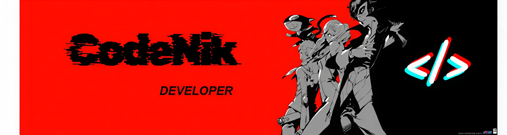
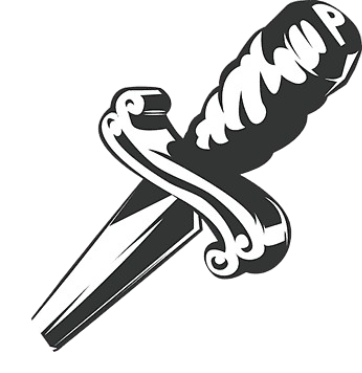
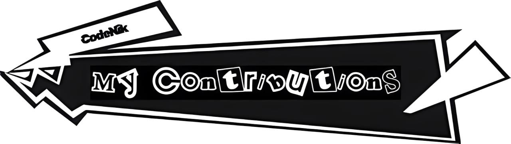
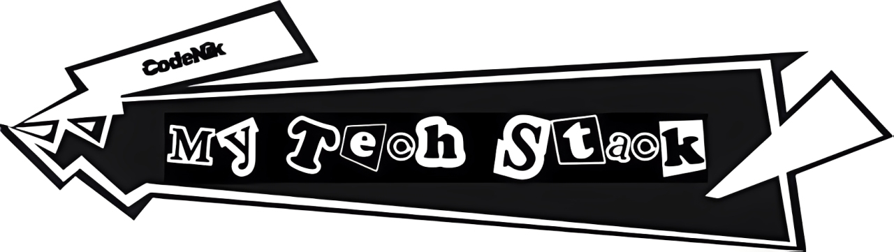

<!--
    Dear user using my README as a base
    to create your own, I’m happy to authorize its use 
    and I’m glad you liked it! I just kindly ask for one thing:

    Please, leave a star on my README it would truly make my day :)
    GitHub: https://github.com/Glauedson
-->

<!-- Banner  -->

  <a href="https://api.github-star-counter.workers.dev/user/codenik01">
     
  </a>
  <a href="https://api.github-star-counter.workers.dev/user/codenik01">
     
  </a>
  

 

<!-- Who am i? -->

**Who Am I?**

I am a **Software Developer** with a strong interest in building **real-world products** across **web and mobile platforms**, currently working as a **freelancer** while actively seeking opportunities in the **technology field**. My journey is driven by **continuous learning**, hands-on problem solving, and a commitment to delivering **reliable, production-ready systems**.

I have developed solid experience in the **web development ecosystem**, with a particular focus on **front-end development**, where logical thinking meets **clean UI design and user experience**. Alongside web technologies, I also work in **mobile development**, building modern applications using **React Native** and **Android Studio**.

In parallel, I have a growing interest in **applied AI, cybersecurity, and secure system design**, focusing on building applications that are not only functional and scalable, but also **secure by design**. I enjoy understanding how systems work end-to-end and identifying ways to improve performance, reliability, and security.

 
 

<!-- badges -->

  <strong>You can Click here</strong>
   

  <!-- Pinterest -->
  
  <!-- Linkedin -->
  
  <!-- GMail  -->
  

 

> [!Caution]
>
> Code is never finished, it only gets **better**.
>
> What you see here is built with **practice**, **curiosity**, and **persistence**.

 

<!-- My contributions title -->

 
 

 

<table align="center">
  <tr>
    <!-- Skills Left -->
    <td valign="top" width="45%">
      
       
       
       
       
       
       
    </td>
    <!---->
    <td valign="top" width="55%">
      

    </td>
  </tr>
</table>

<!--

-->

