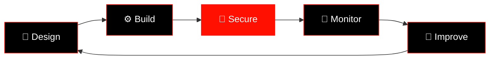
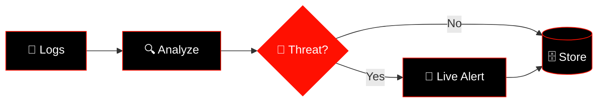

<!-- ===================== BANNER ===================== -->
<a href="https://github.com/codenik01">
  
</a>


<div align="center">

<a href="https://github.com/codenik01">
  
</a>

<br><br>

<a href="https://api.github-star-counter.workers.dev/user/codenik01">
  
</a>
<a href="https://github.com/codenik01?tab=followers">
  
</a>


<br><br>

<a href="https://linkedin.com/in/codenik"></a>
<a href="mailto:nikhilchavan1272@gmail.com"></a>
<a href="https://github.com/codenik01"></a>

</div>


<!-- ===================== ABOUT ===================== -->
## 👨‍💻 Who Am I?


```bash
~/codenik01 $ whoami
> Software Developer | Cloud & Security Builder

~/codenik01 $ cat focus.txt
  ☁️  Cloud Infrastructure
  🛡  DevSecOps
  🔐 Cybersecurity Engineering
  🤖 Applied AI in Security

~/codenik01 $ cat mission.txt
  Build real-world systems that are reliable,
  secure and observable. End to end.

~/codenik01 $ _
```

I design **reliable backend systems, secure architectures, and monitoring platforms** that mirror how modern production environments actually operate.

I love understanding **how complex systems work end-to-end**, from infrastructure to application logic, and then making them faster, safer and more dependable.

<br clear="left"/>


<!-- ===================== CURRENT ===================== -->
## 🎯 Currently

<table align="center">
<tr>
<td align="center" width="25%">☁️<br><b>Building</b><br><sub>Private cloud &<br>monitoring systems</sub></td>
<td align="center" width="25%">📚<br><b>Learning</b><br><sub>DevSecOps &<br>cloud security</sub></td>
<td align="center" width="25%">🔬<br><b>Exploring</b><br><sub>Applied AI<br>in security</sub></td>
<td align="center" width="25%">🤝<br><b>Open to</b><br><sub>Collaboration on<br>infra & security</sub></td>
</tr>
</table>


<!-- ===================== PROJECTS ===================== -->
## 🚀 Featured Projects

<table>
<tr>
<td width="50%" align="center">
  <a href="https://github.com/codenik01/SecureMiniCloud">
    
  </a>
</td>
<td width="50%" align="center">
  <a href="https://github.com/codenik01/Cloud-Security-Monitoring-Platform">
    
  </a>
</td>
</tr>
<tr>
<td colspan="2" align="center">
  <a href="https://github.com/codenik01/AI-Powered-Security-Scanner">
    
  </a>
</td>
</tr>
</table>

<details open>
<summary><b>📖 Project breakdowns</b></summary>
<br>

| Project | What it does | Highlights | Link |
| :-- | :-- | :-- | :--: |
| ☁️ **SecureMiniCloud** | Private cloud platform replicating core AWS services | Object storage • Container orchestration • IAM auth | [🔗 Repo](https://github.com/codenik01/SecureMiniCloud) |
| 🛡 **Cloud Security Monitoring Platform** | Real-time log analysis and attack detection | Brute force detection • API abuse • Live alert dashboard | [🔗 Repo](https://github.com/codenik01/Cloud-Security-Monitoring-Platform) |
| 🔎 **AI Powered Security Scanner** | Automated vulnerability discovery | Auth issues • Misconfigurations • API vulnerabilities | [🔗 Repo](https://github.com/codenik01/AI-Powered-Security-Scanner) |

</details>


<!-- ===================== WORKFLOW ===================== -->
## 🧠 How I Build


```mermaid
flowchart LR
    A[🧩 Design] --> B[⚙️ Build]
    B --> C[🔐 Secure]
    C --> D[📡 Monitor]
    D --> E[🚀 Improve]
    E --> A
    style A fill:#000,stroke:#FF1001,color:#fff
    style B fill:#000,stroke:#FF1001,color:#fff
    style C fill:#FF1001,stroke:#FF1001,color:#fff
    style D fill:#000,stroke:#FF1001,color:#fff
    style E fill:#000,stroke:#FF1001,color:#fff
```

### 🛡 Security pipeline I work with


```mermaid
flowchart LR
    L[📜 Logs] --> P[🔍 Analyze]
    P --> D{🚨 Threat?}
    D -- Yes --> A[📣 Live Alert]
    D -- No --> S[(🗄 Store)]
    A --> S
    style L fill:#000,stroke:#FF1001,color:#fff
    style P fill:#000,stroke:#FF1001,color:#fff
    style D fill:#FF1001,stroke:#FF1001,color:#fff
    style A fill:#000,stroke:#FF1001,color:#fff
    style S fill:#000,stroke:#FF1001,color:#fff
```


<!-- ===================== TECH ===================== -->
## ⚡ Tech Stack

<p align="center">
  
</p>

<details>
<summary><b>🧰 Skills by domain</b></summary>
<br>

<div align="center">

| Domain | Tools |
| :-- | :-- |
| 🌐 **Frontend** |      |
| ⚙️ **Backend** |     |
| ☁️ **Infra & DevOps** |    |
| 🔐 **Security** |    |

</div>

</details>


<!-- ===================== STATS ===================== -->
## 📊 GitHub Stats

<p align="center">
  
  
</p>

<p align="center">
  
</p>


<!-- ===================== ACTIVITY ===================== -->
## 🔥 Contribution Activity

<p align="center">
  
</p>

### 🐍 Contribution Snake

<p align="center">
  
</p>


<!-- ===================== CONNECT ===================== -->
## 🤝 Let's Connect

<div align="center">

Open to collaborating on **cloud**, **security** and **backend infrastructure** projects.

<a href="mailto:nikhilchavan1272@gmail.com"></a>
<a href="https://linkedin.com/in/codenik"></a>

<br><br>


</div>

<br>

> ⚠️ Code is never finished, it only gets **better**.
>
> Everything here is built with **curiosity, experimentation, and persistence.**


